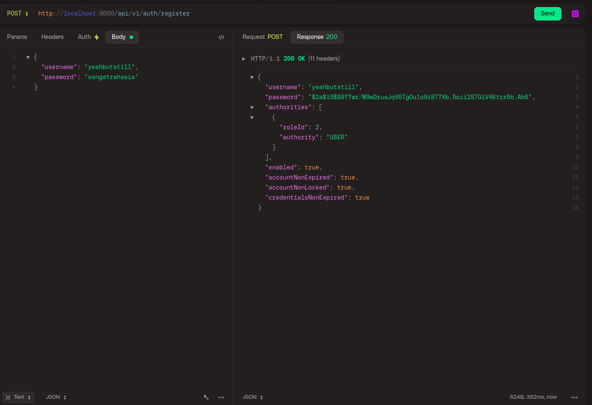
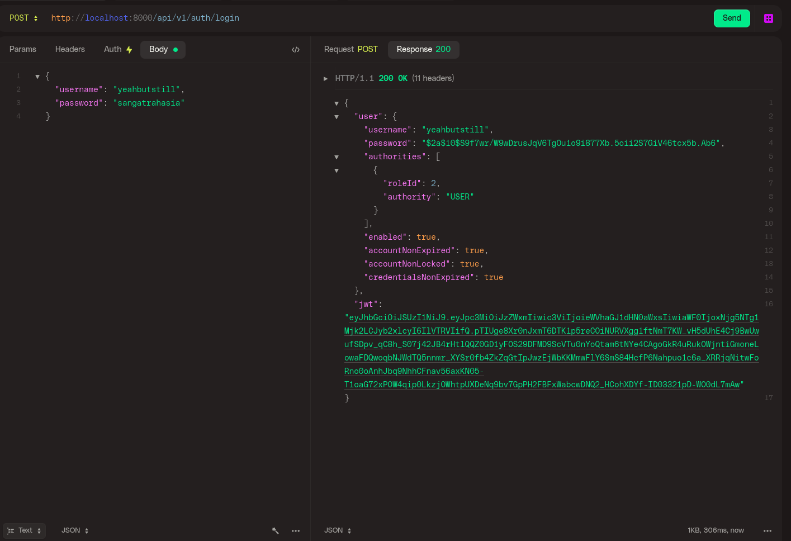
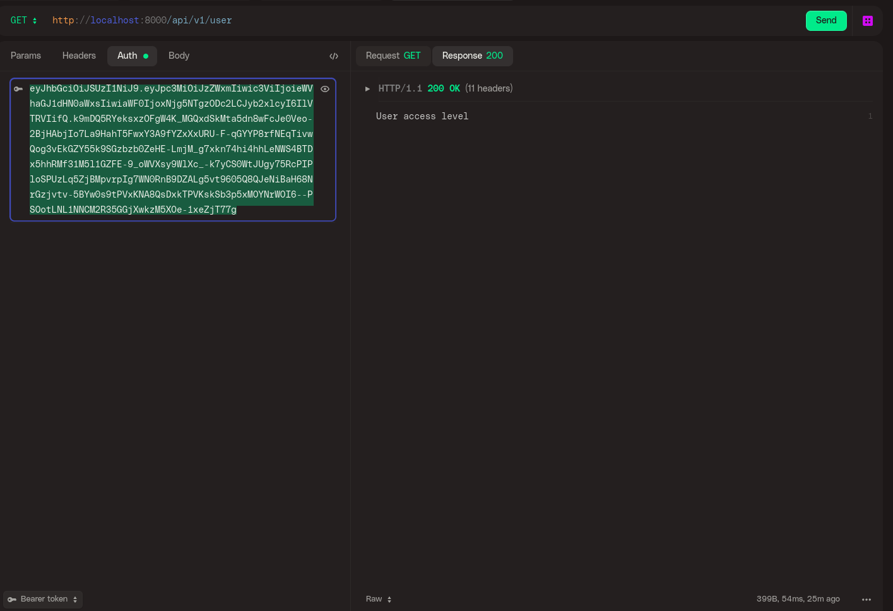

# Spring Security Login System Tutorial Code

## Setup Docker for PostgreSQL
```shell
docker run --rm \
--name restful-demo-spsec6-oauth2 \
-e POSTGRES_DB=demodb \
-e POSTGRES_USER=demo \
-e POSTGRES_PASSWORD=PNSJkxXvVNDAhePMuExTBuRR \
-e PGDATA=/var/lib/postgresql/data/pgdata \
-v "$PWD/demodb-data:/var/lib/postgresql/data" \
-p 5431:5432 \
postgres:15
```

```http request
POST http://localhost:8000/api/v1/auth/register
```


```http request
POST http://localhost:8000/api/v1/auth/login
```


```http request
GET http://localhost:8000/api/v1/user
```
copy your jwt token if login successfully



Java application code for a Spring Boot 3+, Spring Data JPA, Spring Security, Spring Web, and OAuth2Resource server application which allows users to login or register using HTTP POST requests, then view endpoints based on their roles.

Users are authenticated against a database using a custom `UserDetailsService` and `AuthenticationManager` along with Spring Data JPA repositories.

When a successful login occurs, a JWT is generated and sent back to the user, the user can use this JWT in the header as a bearer token to access authenticated routes according to their roles

[Follow the youtube tutorial here]()